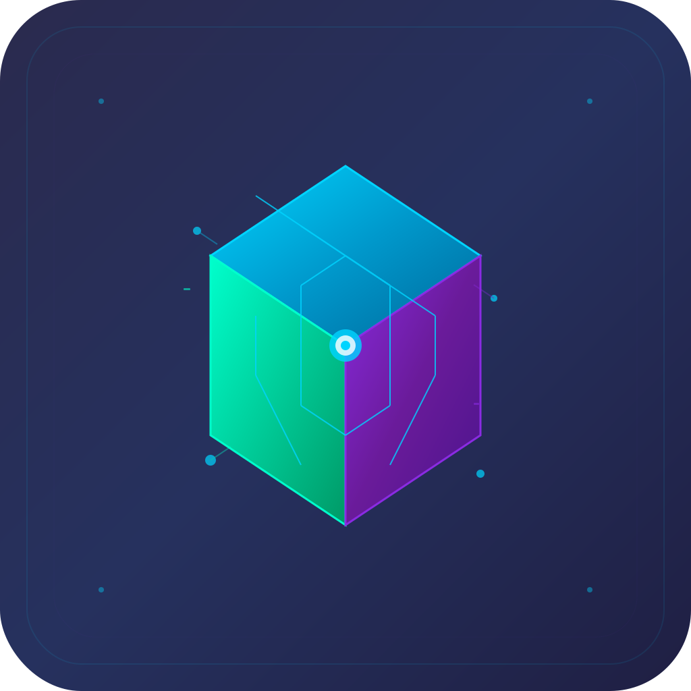
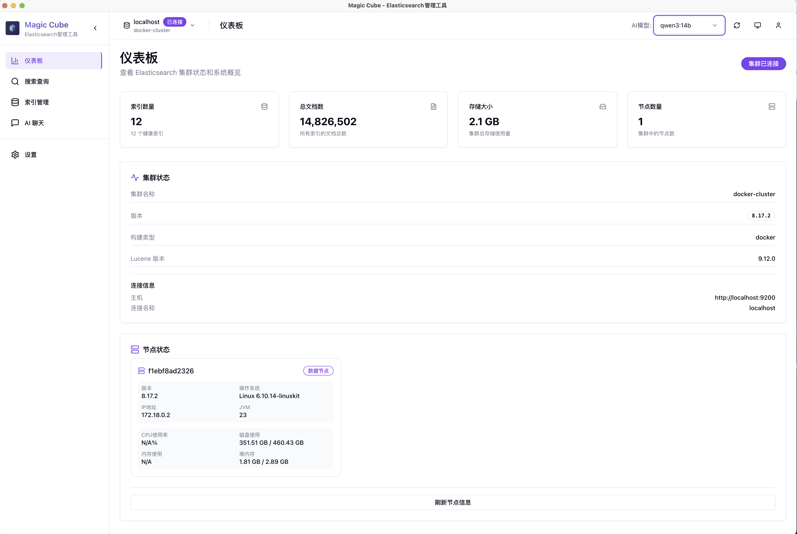

# Magic Cube App

<div align="center">
  
</div>

🎯 **Elasticsearch管理工具，集成AI聊天功能**

一款功能全面的Elasticsearch管理工具，集成了AI聊天辅助功能，让数据操作更简单。

## ✨ 特性

- 🔍 多集群管理和连接
- 📈 查询结果可视化
- 💬 AI聊天辅助功能
- 🛡️ 本地运行，保护数据隐私
- 💻 跨平台桌面应用

## 📸 应用截图

<div align="center">
  
</div>

## 🚀 快速开始

### 环境要求
- Node.js 22+
- Ollama
- Elasticsearch

### 安装运行
```bash
# 克隆项目
git clone https://github.com/your-username/magic-cube-app.git
cd magic-cube-app

# 安装依赖
npm install

# 开发模式
npm run dev
npm run dev:electron

# 构建
npm run build
```

## 📖 使用

1. **安装 Ollama**
   ```bash
   ollama serve
   ollama pull qwen3:14b
   ```

2. **配置 Elasticsearch 连接**
   - 输入 ES 地址和认证信息
   - 测试连接

3. **使用AI聊天**
   ```
   可以向AI助手询问Elasticsearch相关问题
   ```

## 📄 许可证

MIT License

## 🙏 致谢

- [Ollama](https://ollama.ai/) - 本地 AI 模型运行时
- [Elasticsearch](https://www.elastic.co/) - 搜索和分析引擎
- [Electron](https://electronjs.org/) - 跨平台桌面应用框架
- [React](https://reactjs.org/) - 用户界面库
- [Radix UI](https://www.radix-ui.com/) - UI 组件
- [Tailwind CSS](https://tailwindcss.com/) - CSS 框架
